# Comprehensive LinkedIn Lead Generation & Automation System

I understand your request for an end-to-end LinkedIn automation system focused on enterprise AI software development prospects. I'll create:

1. A complete N8N workflow JSON for LinkedIn lead generation, qualification, and outreach
2. A comprehensive implementation guide with step-by-step instructions
3. A Mermaid diagram showing the entire system architecture

Let's build a system that will consistently deliver 5 qualified sales calls weekly for your custom AI software development services, targeting prospects with $5K-25K budgets.

## Part 1: N8N Workflow JSON

```json
{
  "name": "LinkedIn AI Software Development Lead Generation Pipeline",
  "nodes": [
    {
      "id": "linkedInProspectingTrigger",
      "type": "n8n-nodes-base.schedule",
      "typeVersion": 1,
      "position": [100, 300],
      "parameters": {
        "triggerTimes": {
          "item": [
            {
              "mode": "everyWeekOn",
              "hour": 8,
              "minute": 0,
              "weekDay": 1
            },
            {
              "mode": "everyWeekOn",
              "hour": 8,
              "minute": 0,
              "weekDay": 3
            },
            {
              "mode": "everyWeekOn",
              "hour": 8,
              "minute": 0,
              "weekDay": 5
            }
          ]
        }
      }
    },
    {
      "id": "setGlobalVariables",
      "type": "n8n-nodes-base.set",
      "typeVersion": 1,
      "position": [100, 100],
      "parameters": {
        "values": {
          "string": [
            {
              "name": "phantomBusterApiKey",
              "value": "YOUR_PHANTOMBUSTER_API_KEY"
            },
            {
              "name": "phantomIdLinkedInSearch",
              "value": "YOUR_SEARCH_PHANTOM_ID"
            },
            {
              "name": "phantomIdProfileScraper",
              "value": "YOUR_PROFILE_SCRAPER_PHANTOM_ID"
            },
            {
              "name": "phantomIdMessageSender",
              "value": "YOUR_MESSAGE_SENDER_PHANTOM_ID"
            },
            {
              "name": "apolloApiKey",
              "value": "YOUR_APOLLO_API_KEY"
            },
            {
              "name": "clearbitApiKey",
              "value": "YOUR_CLEARBIT_API_KEY"
            },
            {
              "name": "zoomInfoApiKey",
              "value": "YOUR_ZOOMINFO_API_KEY"
            },
            {
              "name": "zoomInfoSecretKey",
              "value": "YOUR_ZOOMINFO_SECRET_KEY"
            },
            {
              "name": "airtableApiKey",
              "value": "YOUR_AIRTABLE_API_KEY"
            },
            {
              "name": "airtableBase",
              "value": "YOUR_AIRTABLE_BASE_ID"
            },
            {
              "name": "googleCalendarAuthToken",
              "value": "YOUR_GCAL_TOKEN"
            },
            {
              "name": "calendlyApiKey",
              "value": "YOUR_CALENDLY_API_KEY"
            },
            {
              "name": "calendlyEventTypeLink",
              "value": "https://calendly.com/yourusername/ai-software-consultation"
            },
            {
              "name": "openAIApiKey", 
              "value": "YOUR_OPENAI_API_KEY"
            },
            {
              "name": "gmailAppPassword",
              "value": "YOUR_GMAIL_APP_PASSWORD"
            },
            {
              "name": "gmailAddress",
              "value": "your.email@gmail.com"
            },
            {
              "name": "slackWebhookUrl",
              "value": "YOUR_SLACK_WEBHOOK_URL"
            },
            {
              "name": "targetLinkedInSearchUrls",
              "value": ["https://www.linkedin.com/search/results/people/?geoUrn=%5B%22103644278%22%5D&industry=%5B%2296%22%2C%229%22%2C%2249%22%2C%226%22%5D&keywords=CTO%20OR%20CIO%20OR%20%22Head%20of%20Technology%22%20OR%20%22VP%20of%20IT%22&origin=FACETED_SEARCH&sid=kH%2C", "https://www.linkedin.com/search/results/people/?geoUrn=%5B%22103644278%22%5D&industry=%5B%2296%22%2C%2249%22%2C%226%22%5D&keywords=CEO%20OR%20founder%20OR%20%22Chief%20Executive%22&origin=FACETED_SEARCH&sid=6B*", "https://www.linkedin.com/search/results/people/?geoUrn=%5B%22103644278%22%5D&industry=%5B%2296%22%2C%2249%22%2C%226%22%5D&keywords=%22digital%20transformation%22%20OR%20%22AI%20implementation%22&origin=FACETED_SEARCH&sid=(hU"]
            },
            {
              "name": "initialConnectionMessage",
              "value": "Hi {{firstName}}, I noticed your work in {{industry}} and thought we might connect. I help technology leaders implement custom AI solutions that solve specific business challenges. No pitch intended - just looking to expand my network with fellow tech professionals."
            },
            {
              "name": "followUpMessage1",
              "value": "Thanks for connecting, {{firstName}}! Quick question - what's the biggest challenge your team is facing right now with leveraging AI/automation in your operations? Many {{industry}} leaders I work with are struggling with [relevant industry challenge]. Curious if that resonates with your experience."
            },
            {
              "name": "followUpMessage2",
              "value": "Hi {{firstName}}, just following up on my previous message. I recently helped a {{industry}} company implement a custom AI solution that [specific outcome - e.g., reduced processing time by 60%]. I'd be happy to share how we approached it if that's relevant to your current initiatives. Alternatively, I can share a brief case study if you'd prefer."
            },
            {
              "name": "followUpMessage3",
              "value": "{{firstName}}, I understand how busy things get. I've put together a quick 2-minute video explaining how we've helped companies similar to {{company}} implement custom AI solutions that delivered [specific result]. Would that be valuable to you? I can send a private link: {{calendarLink}}"
            },
            {
              "name": "companyTypes",
              "value": ["SaaS", "FinTech", "Healthcare", "Manufacturing", "Retail", "Logistics", "InsurTech", "EdTech", "Real Estate"]
            },
            {
              "name": "targetCompanySizes",
              "value": ["51-200", "201-500", "501-1000", "1001-5000"]
            },
            {
              "name": "targetJobTitles",
              "value": ["CTO", "CIO", "VP of Engineering", "VP of Technology", "VP of IT", "Director of IT", "Head of Innovation", "Digital Transformation", "CEO", "Founder", "Chief Technology Officer", "Chief Information Officer"]
            },
            {
              "name": "exclusionTerms",
              "value": ["student", "intern", "freelancer", "looking for work", "seeking opportunities"]
            },
            {
              "name": "targetIndustries",
              "value": ["Information Technology", "Financial Services", "Healthcare", "Manufacturing", "Retail", "Logistics", "Insurance", "Education", "Real Estate"]
            },
            {
              "name": "aiSolutionTypes",
              "value": ["Predictive Analytics", "Process Automation", "Document Processing", "Computer Vision", "Natural Language Processing", "Recommendation Systems", "Anomaly Detection"]
            }
          ]
        }
      }
    },
    {
      "id": "executeLinkedInSearch",
      "type": "n8n-nodes-base.phantomBuster",
      "typeVersion": 1,
      "position": [300, 300],
      "parameters": {
        "apiKey": "={{$node[\"setGlobalVariables\"].json[\"phantomBusterApiKey\"]}}",
        "phantomId": "={{$node[\"setGlobalVariables\"].json[\"phantomIdLinkedInSearch\"]}}",
        "jsonParameters": true,
        "argumentsUi": {
          "arguments": [
            {
              "name": "sessionCookie",
              "value": "YOUR_LINKEDIN_SESSION_COOKIE"
            },
            {
              "name": "spreadsheetUrl",
              "value": "={{$node[\"setGlobalVariables\"].json[\"targetLinkedInSearchUrls\"]}}"
            },
            {
              "name": "numberOfProfilesToScrape",
              "value": 50
            }
          ]
        }
      }
    },
    {
      "id": "processProfiles",
      "type": "n8n-nodes-base.function",
      "typeVersion": 1,
      "position": [500, 300],
      "parameters": {
        "functionCode": "// Process and filter profiles\nconst profiles = items[0].json.data || [];\nconst targetCompanySizes = $node[\"setGlobalVariables\"].json[\"targetCompanySizes\"];\nconst targetJobTitles = $node[\"setGlobalVariables\"].json[\"targetJobTitles\"];\nconst exclusionTerms = $node[\"setGlobalVariables\"].json[\"exclusionTerms\"];\nconst targetIndustries = $node[\"setGlobalVariables\"].json[\"targetIndustries\"];\n\nconst filteredProfiles = profiles.filter(profile => {\n  // Check for basic profile data\n  if (!profile.fullName || !profile.profileUrl || !profile.title) {\n    return false;\n  }\n  \n  // Check for exclusion terms\n  const profileText = (profile.fullName + ' ' + profile.title + ' ' + (profile.description || '')).toLowerCase();\n  if (exclusionTerms.some(term => profileText.includes(term.toLowerCase()))) {\n    return false;\n  }\n  \n  // Check for job title match\n  const hasTargetTitle = targetJobTitles.some(title => {\n    return profile.title && profile.title.toLowerCase().includes(title.toLowerCase());\n  });\n  \n  if (!hasTargetTitle) {\n    return false;\n  }\n  \n  // Basic company size and industry filtering if available\n  if (profile.companySize && !targetCompanySizes.includes(profile.companySize)) {\n    return false;\n  }\n  \n  if (profile.industry && !targetIndustries.some(industry => profile.industry.toLowerCase().includes(industry.toLowerCase()))) {\n    return false;\n  }\n  \n  return true;\n});\n\n// Format the data for the next node\nreturn filteredProfiles.map(profile => {\n  return {\n    json: {\n      fullName: profile.fullName,\n      firstName: profile.fullName.split(' ')[0],\n      lastName: profile.fullName.split(' ').slice(1).join(' '),\n      profileUrl: profile.profileUrl,\n      title: profile.title,\n      company: profile.company || '',\n      industry: profile.industry || '',\n      location: profile.location || '',\n      companySize: profile.companySize || '',\n      description: profile.description || '',\n      connectionDegree: profile.connectionDegree || '',\n      isProcessed: false,\n      isQualified: false,\n      score: 0\n    }\n  };\n});"
      }
    },
    {
      "id": "checkExistingProfiles",
      "type": "n8n-nodes-base.airtable",
      "typeVersion": 1,
      "position": [700, 300],
      "parameters": {
        "operation": "list",
        "application": "={{$node[\"setGlobalVariables\"].json[\"airtableBase\"]}}",
        "table": "LinkedIn Prospects",
        "returnAll": true
      },
      "credentials": {
        "airtableApi": {
          "id": "airtable-credentials",
          "name": "Airtable account"
        }
      }
    },
    {
      "id": "filterNewProfiles",
      "type": "n8n-nodes-base.function",
      "typeVersion": 1,
      "position": [900, 300],
      "parameters": {
        "functionCode": "// Get existing profiles from Airtable\nconst existingProfiles = $node[\"checkExistingProfiles\"].json.map(record => record.fields.profileUrl);\n\n// Filter out profiles that already exist in Airtable\nconst newProfiles = items.filter(item => {\n  return !existingProfiles.includes(item.json.profileUrl);\n});\n\nreturn newProfiles;"
      }
    },
    {
      "id": "scrapeDetailedProfiles",
      "type": "n8n-nodes-base.phantomBuster",
      "typeVersion": 1,
      "position": [1100, 300],
      "parameters": {
        "apiKey": "={{$node[\"setGlobalVariables\"].json[\"phantomBusterApiKey\"]}}",
        "phantomId": "={{$node[\"setGlobalVariables\"].json[\"phantomIdProfileScraper\"]}}",
        "jsonParameters": true,
        "argumentsUi": {
          "arguments": [
            {
              "name": "sessionCookie",
              "value": "YOUR_LINKEDIN_SESSION_COOKIE"
            },
            {
              "name": "profileUrls",
              "value": "={{$json[\"profileUrl\"]}}"
            },
            {
              "name": "scrapeBasicInfo",
              "value": true
            },
            {
              "name": "scrapeDetails",
              "value": true
            },
            {
              "name": "scrapeActivityFeed",
              "value": true
            },
            {
              "name": "maxPosts",
              "value": 5
            }
          ]
        }
      }
    },
    {
      "id": "enrichWithApollo",
      "type": "n8n-nodes-base.httpRequest",
      "typeVersion": 1,
      "position": [1300, 200],
      "parameters": {
        "url": "https://api.apollo.io/v1/people/search",
        "method": "POST",
        "authentication": "headerAuth",
        "headerParameters": {
          "parameters": [
            {
              "name": "x-api-key",
              "value": "={{$node[\"setGlobalVariables\"].json[\"apolloApiKey\"]}}"
            }
          ]
        },
        "jsonParameters": true,
        "bodyParameters": {
          "parameters": [
            {
              "name": "q_organization_domains",
              "value": "={{$json[\"company\"] ? $json[\"company\"].toLowerCase().replace(/\\s+/g, '') + '.com' : null}}"
            },
            {
              "name": "q_names",
              "value": "={{$json[\"fullName\"]}}"
            },
            {
              "name": "page",
              "value": 1
            },
            {
              "name": "per_page",
              "value": 1
            }
          ]
        }
      }
    },
    {
      "id": "enrichWithClearbit",
      "type": "n8n-nodes-base.httpRequest",
      "typeVersion": 1,
      "position": [1300, 400],
      "parameters": {
        "url": "=https://person.clearbit.com/v2/people/find?email={{$json[\"email\"]}}",
        "method": "GET",
        "authentication": "basicAuth",
        "username": "={{$node[\"setGlobalVariables\"].json[\"clearbitApiKey\"]}}",
        "password": ""
      }
    },
    {
      "id": "deriveCompanyDomain",
      "type": "n8n-nodes-base.function",
      "typeVersion": 1,
      "position": [1100, 200],
      "parameters": {
        "functionCode": "// Extract basic domain from company name\nconst companyName = $json[\"company\"];\n\nif (!companyName) {\n  return {json: { ...$json, companyDomain: null, email: null }};\n}\n\n// Clean up company name for domain\nlet domain = companyName\n  .toLowerCase()\n  .replace(/\\s+/g, '')\n  .replace(/[^a-z0-9]/g, '');\n\n// Add .com extension\ndomain = domain + '.com';\n\n// Generate likely email patterns\nconst firstName = $json.firstName.toLowerCase();\nconst lastName = $json.lastName.toLowerCase();\nconst possibleEmails = [\n  `${firstName}@${domain}`,\n  `${firstName}.${lastName}@${domain}`,\n  `${firstName[0]}${lastName}@${domain}`,\n  `${lastName}@${domain}`,\n  `${firstName}-${lastName}@${domain}`,\n  `${firstName}_${lastName}@${domain}`\n];\n\n// Return with most likely email format\nreturn {\n  json: {\n    ...$json,\n    companyDomain: domain,\n    email: possibleEmails[1], // Most common format\n    possibleEmails\n  }\n};"
      }
    },
    {
      "id": "companyLookup",
      "type": "n8n-nodes-base.httpRequest",
      "typeVersion": 1,
      "position": [1300, 100],
      "parameters": {
        "url": "=https://company.clearbit.com/v2/companies/find?domain={{$json[\"companyDomain\"]}}",
        "method": "GET",
        "authentication": "basicAuth",
        "username": "={{$node[\"setGlobalVariables\"].json[\"clearbitApiKey\"]}}",
        "password": ""
      }
    },
    {
      "id": "mergeProfileData",
      "type": "n8n-nodes-base.function",
      "typeVersion": 1,
      "position": [1500, 300],
      "parameters": {
        "functionCode": "// Get detailed profile from PhantomBuster scrape\nconst scrapedProfile = $json;\n\n// Get enrichment data from Apollo\nconst apolloData = $node[\"enrichWithApollo\"].json?.data?.people?.[0] || {};\n\n// Get company data from Clearbit\nconst companyData = $node[\"companyLookup\"].json || {};\n\n// Get person data from Clearbit\nconst personData = $node[\"enrichWithClearbit\"].json || {};\n\n// Merge all data sources with priority\nconst mergedProfile = {\n  // Basic profile info\n  fullName: scrapedProfile.fullName,\n  firstName: scrapedProfile.firstName,\n  lastName: scrapedProfile.lastName,\n  profileUrl: scrapedProfile.profileUrl,\n  title: scrapedProfile.title,\n  company: scrapedProfile.company,\n  location: scrapedProfile.location,\n  \n  // Contact information (prioritize Apollo > Clearbit > generated)\n  email: apolloData.email || personData.email || scrapedProfile.email || null,\n  phone: apolloData.phone || personData.phone || null,\n  \n  // Company information (prioritize Clearbit > Apollo > scraped)\n  companyDomain: companyData.domain || apolloData.organization_website || scrapedProfile.companyDomain || null,\n  companySize: companyData.metrics?.employees || apolloData.organization_size || scrapedProfile.companySize || null,\n  companyIndustry: companyData.category?.industry || apolloData.organization_industry || scrapedProfile.industry || null,\n  companyRevenue: companyData.metrics?.estimatedAnnualRevenue || apolloData.organization_estimated_revenue || null,\n  companyDescription: companyData.description || apolloData.organization_description || null,\n  companySocialProfiles: companyData.facebook || companyData.twitter ? { facebook: companyData.facebook?.handle, twitter: companyData.twitter?.handle } : null,\n  \n  // Additional context from LinkedIn scrape\n  description: scrapedProfile.description || null,\n  connectionDegree: scrapedProfile.connectionDegree || null,\n  recentPosts: scrapedProfile.recentPosts || [],\n  recentActivities: scrapedProfile.recentActivities || [],\n  skills: scrapedProfile.skills || [],\n  \n  // Tracking fields\n  isProcessed: false,\n  isConnected: false,\n  isQualified: false,\n  leadScore: 0,\n  lastActivityDate: null,\n  stage: \"New\",\n  notes: \"\",\n  tags: []\n};\n\n// Calculate lead score based on key attributes\nlet score = 0;\n\n// Job title scoring\nconst executiveRoles = [\"CEO\", \"CTO\", \"CIO\", \"Chief\", \"VP\", \"Head\", \"Director\"];\nif (executiveRoles.some(role => mergedProfile.title.includes(role))) {\n  score += 20;\n} else if (mergedProfile.title.includes(\"Manager\")) {\n  score += 10;\n}\n\n// Company size scoring\nif (mergedProfile.companySize) {\n  const size = typeof mergedProfile.companySize === 'number' ? \n    mergedProfile.companySize : \n    parseInt(mergedProfile.companySize.replace(/[^0-9]/g, ''));\n    \n  if (size > 1000) score += 25;\n  else if (size > 500) score += 20;\n  else if (size > 200) score += 15;\n  else if (size > 50) score += 10;\n}\n\n// Industry relevance\nconst targetIndustries = $node[\"setGlobalVariables\"].json[\"targetIndustries\"];\nif (mergedProfile.companyIndustry && targetIndustries.some(industry => \n  mergedProfile.companyIndustry.toLowerCase().includes(industry.toLowerCase()))) {\n  score += 15;\n}\n\n// Revenue indicator\nif (mergedProfile.companyRevenue) {\n  const revenueMatch = mergedProfile.companyRevenue.match(/(\\d+)/);\n  if (revenueMatch) {\n    const revenue = parseInt(revenueMatch[1]);\n    if (revenue > 50) score += 20;\n    else if (revenue > 10) score += 15;\n    else score += 5;\n  }\n}\n\n// Content indicators - looking for AI, automation, digital transformation\nconst aiTerms = ['ai', 'artificial intelligence', 'machine learning', 'automation', 'digital transformation', \n  'workflow', 'efficiency', 'data science', 'analytics', 'algorithm'];\n  \nconst profileText = [\n  mergedProfile.description,\n  mergedProfile.recentPosts?.map(p => p.text).join(' '),\n  mergedProfile.recentActivities?.map(a => a.text).join(' '),\n  mergedProfile.skills?.join(' ')\n].filter(Boolean).join(' ').toLowerCase();\n\nconst aiMentionsCount = aiTerms.reduce((count, term) => {\n  const regex = new RegExp(term, 'gi');\n  const matches = profileText.match(regex);\n  return count + (matches ? matches.length : 0);\n}, 0);\n\nif (aiMentionsCount > 5) score += 20;\nelse if (aiMentionsCount > 2) score += 10;\nelse if (aiMentionsCount > 0) score += 5;\n\n// Set the lead score\nmergedProfile.leadScore = score;\n\n// Auto-qualify if score is high enough\nif (score >= 50) {\n  mergedProfile.isQualified = true;\n}\n\n// Add relevant tags\nmergedProfile.tags = [];\n\nif (score >= 70) mergedProfile.tags.push(\"Hot Lead\");\nelse if (score >= 50) mergedProfile.tags.push(\"Warm Lead\");\nelse mergedProfile.tags.push(\"Cold Lead\");\n\n// Industry tag\nif (mergedProfile.companyIndustry) {\n  mergedProfile.tags.push(mergedProfile.companyIndustry);\n}\n\n// Size tag\nif (mergedProfile.companySize) {\n  if (typeof mergedProfile.companySize === 'number') {\n    if (mergedProfile.companySize > 1000) mergedProfile.tags.push(\"Enterprise\");\n    else if (mergedProfile.companySize > 200) mergedProfile.tags.push(\"Mid-Market\");\n    else mergedProfile.tags.push(\"SMB\");\n  } else if (typeof mergedProfile.companySize === 'string') {\n    mergedProfile.tags.push(mergedProfile.companySize);\n  }\n}\n\n// AI interest tags\nif (aiMentionsCount > 0) {\n  mergedProfile.tags.push(\"AI Interest\");\n  \n  // Check for specific AI solution interest\nconst aiSolutionTypes = $node[\"setGlobalVariables\"].json[\"aiSolutionTypes\"];\nfor (const solution of aiSolutionTypes) {\n  if (profileText.includes(solution.toLowerCase())) {\n    mergedProfile.tags.push(solution);\n  }\n}\n}\n\nreturn {json: mergedProfile};"
      }
    },
    {
      "id": "generatePersonalizedNotes",
      "type": "n8n-nodes-base.httpRequest",
      "typeVersion": 1,
      "position": [1700, 300],
      "parameters": {
        "url": "https://api.openai.com/v1/chat/completions",
        "method": "POST",
        "authentication": "headerAuth",
        "headerParameters": {
          "parameters": [
            {
              "name": "Authorization",
              "value": "=Bearer {{$node[\"setGlobalVariables\"].json[\"openAIApiKey\"]}}"
            },
            {
              "name": "Content-Type",
              "value": "application/json"
            }
          ]
        },
        "jsonParameters": true,
        "bodyParameters": {
          "parameters": [
            {
              "name": "model",
              "value": "gpt-4-turbo"
            },
            {
              "name": "temperature",
              "value": 0.7
            },
            {
              "name": "messages",
              "value": [
                {
                  "role": "system",
                  "content": "You are an expert sales researcher for a custom AI software development company. Your job is to analyze LinkedIn profiles and identify personalized conversation starters and qualification notes. Focus on finding specific AI application opportunities based on the prospect's industry, role, and company information."
                },
                {
                  "role": "user", 
                  "content": "=Create personalized notes for a potential AI software development client with the following profile information:\n\nName: {{$json[\"fullName\"]}}\nJob Title: {{$json[\"title\"]}}\nCompany: {{$json[\"company\"]}}\nIndustry: {{$json[\"companyIndustry\"]}}\nCompany Size: {{$json[\"companySize\"]}}\nCompany Description: {{$json[\"companyDescription\"]}}\nLinkedIn Description: {{$json[\"description\"]}}\nRecent Posts/Activities: {{$json[\"recentPosts\"] ? JSON.stringify($json[\"recentPosts\"]) : 'None'}}\nSkills: {{$json[\"skills\"] ? JSON.stringify($json[\"skills\"]) : 'None'}}\n\nProvide the following sections:\n1. Personalized conversation starters (3 options)\n2. Potential AI use cases for their specific industry and role\n3. Qualification assessment (are they likely to have budget for a $5K-25K project?)\n4. Custom connection message based on their profile\n5. Relevant case study or reference we should mention"
                }
              ]
            },
            {
              "name": "max_tokens",
              "value": 800
            }
          ]
        }
      }
    },
    {
      "id": "parseGeneratedNotes",
      "type": "n8n-nodes-base.function",
      "typeVersion": 1,
      "position": [1900, 300],
      "parameters": {
        "functionCode": "// Get the response from OpenAI\nconst aiResponse = $json.choices[0].message.content;\n\n// Add AI-generated insights to the profile\nreturn {\n  json: {\n    ...$node[\"mergeProfileData\"].json,\n    aiGeneratedNotes: aiResponse,\n    lastUpdated: new Date().toISOString()\n  }\n};"
      }
    },
    {
      "id": "createAirtableRecord",
      "type": "n8n-nodes-base.airtable",
      "typeVersion": 1,
      "position": [2100, 300],
      "parameters": {
        "operation": "append",
        "application": "={{$node[\"setGlobalVariables\"].json[\"airtableBase\"]}}",
        "table": "LinkedIn Prospects",
        "options": {},
        "columns": {
          "Full Name": "={{$json[\"fullName\"]}}",
          "First Name": "={{$json[\"firstName\"]}}",
          "Last Name": "={{$json[\"lastName\"]}}",
          "Title": "={{$json[\"title\"]}}",
          "Company": "={{$json[\"company\"]}}",
          "LinkedIn URL": "={{$json[\"profileUrl\"]}}",
          "Email": "={{$json[\"email\"]}}",
          "Phone": "={{$json[\"phone\"]}}",
          "Location": "={{$json[\"location\"]}}",
          "Company Size": "={{$json[\"companySize\"]}}",
          "Industry": "={{$json[\"companyIndustry\"]}}",
          "Company Revenue": "={{$json[\"companyRevenue\"]}}",
          "Company Domain": "={{$json[\"companyDomain\"]}}",
          "Lead Score": "={{$json[\"leadScore\"]}}",
          "Is Qualified": "={{$json[\"isQualified\"]}}",
          "Is Connected": "={{$json[\"isConnected\"]}}",
          "Stage": "={{$json[\"stage\"]}}",
          "Tags": "={{$json[\"tags\"].join(\", \")}}",
          "Notes": "={{$json[\"aiGeneratedNotes\"]}}",
          "Last Updated": "={{$json[\"lastUpdated\"]}}"
        }
      },
      "credentials": {
        "airtableApi": {
          "id": "airtable-credentials",
          "name": "Airtable account"
        }
      }
    },
    {
      "id": "notifySlack",
      "type": "n8n-nodes-base.httpRequest",
      "typeVersion": 1,
      "position": [2300, 300],
      "parameters": {
        "url": "={{$node[\"setGlobalVariables\"].json[\"slackWebhookUrl\"]}}",
        "method": "POST",
        "jsonParameters": true,
        "bodyParameters": {
          "parameters": [
            {
              "name": "blocks",
              "value": [
                {
                  "type": "header",
                  "text": {
                    "type": "plain_text",
                    "text": "=New LinkedIn Prospect: {{$json[\"fullName\"]}}",
                    "emoji": true
                  }
                },
                {
                  "type": "section",
                  "fields": [
                    {
                      "type": "mrkdwn",
                      "text": "*Company:*\n{{$json[\"company\"]}}"
                    },
                    {
                      "type": "mrkdwn",
                      "text": "*Title:*\n{{$json[\"title\"]}}"
                    },
                    {
                      "type": "mrkdwn",
                      "text": "*Industry:*\n{{$json[\"companyIndustry\"]}}"
                    },
                    {
                      "type": "mrkdwn",
                      "text": "*Score:*\n{{$json[\"leadScore\"]}}/100"
                    }
                  ]
                },
                {
                  "type": "section",
                  "text": {
                    "type": "mrkdwn",
                    "text": "=*AI Notes:*\n```{{$json[\"aiGeneratedNotes\"].substring(0, 250)}}...```"
                  }
                },
                {
                  "type": "actions",
                  "elements": [
                    {
                      "type": "button",
                      "text": {
                        "type": "plain_text",
                        "text": "View Profile",
                        "emoji": true
                      },
                      "url": "={{$json[\"profileUrl\"]}}"
                    },
                    {
                      "type": "button",
                      "text": {
                        "type": "plain_text",
                        "text": "View in Airtable",
                        "emoji": true
                      },
                      "url": "=https://airtable.com/{{$node[\"setGlobalVariables\"].json[\"airtableBase\"]}}/{{$node[\"createAirtableRecord\"].json[\"id\"]}}"
                    }
                  ]
                }
              ]
            }
          ]
        }
      }
    },
    {
      "id": "connectionMessagesTrigger",
      "type": "n8n-nodes-base.schedule",
      "typeVersion": 1,
      "position": [100, 500],
      "parameters": {
        "triggerTimes": {
          "item": [
            {
              "mode": "everyWeekOn",
              "hour": 10,
              "minute": 0,
              "weekDay": 2
            },
            {
              "mode": "everyWeekOn",
              "hour": 10,
              "minute": 0,
              "weekDay": 4
            }
          ]
        }
      }
    },
    {
      "id": "getQualifiedProspects",
      "type": "n8n-nodes-base.airtable",
      "typeVersion": 1,
      "position": [300, 500],
      "parameters": {
        "operation": "list",
        "application": "={{$node[\"setGlobalVariables\"].json[\"airtableBase\"]}}",
        "table": "LinkedIn Prospects",
        "options": {
          "filterByFormula": "AND({Is Qualified}=1, {Is Connected}=0, {Connection Requested}=0)"
        }
      },
      "credentials": {
        "airtableApi": {
          "id": "airtable-credentials",
          "name": "Airtable account"
        }
      }
    },
    {
      "id": "limitConnectionsDaily",
      "type": "n8n-nodes-base.function",
      "typeVersion": 1,
      "position": [500, 500],
      "parameters": {
        "functionCode": "// Limit to sending 15 connection requests per day\nlet prospects = items;\n\n// Sort by lead score (highest first)\nprospects.sort((a, b) => b.json.fields[\"Lead Score\"] - a.json.fields[\"Lead Score\"]);\n\n// Limit to 15 connections\nprospects = prospects.slice(0, 15);\n\nreturn prospects.map(item => {\n  // Extract the fields we need for sending connection requests\n  return {\n    json: {\n      recordId: item.json.id,\n      fullName: item.json.fields[\"Full Name\"],\n      firstName: item.json.fields[\"First Name\"],\n      profileUrl: item.json.fields[\"LinkedIn URL\"],\n      company: item.json.fields[\"Company\"],\n      industry: item.json.fields[\"Industry\"],\n      aiGeneratedNotes: item.json.fields[\"Notes\"]\n    }\n  };\n});"
      }
    },
    {
      "id": "createConnectionMessage",
      "type": "n8n-nodes-base.function",
      "typeVersion": 1,
      "position": [700, 500],
      "parameters": {
        "functionCode": "// Get the profile data\nconst profile = $json;\n\n// Get the default connection message template\nconst defaultTemplate = $node[\"setGlobalVariables\"].json[\"initialConnectionMessage\"];\n\n// Try to extract a personalized message from AI notes\nlet personalizedMessage = null;\nif (profile.aiGeneratedNotes) {\n  // Look for a custom connection message section in the AI notes\n  const customMessageMatch = profile.aiGeneratedNotes.match(/4\\. Custom connection message[:\\s]+(.*?)(?=\\n\\d\\.|$)/s);\n  if (customMessageMatch && customMessageMatch[1]) {\n    personalizedMessage = customMessageMatch[1].trim();\n  }\n}\n\n// Use the personalized message if available, otherwise use the template\nlet finalMessage = personalizedMessage || defaultTemplate;\n\n// Replace template variables\nfinalMessage = finalMessage\n  .replace(/{{firstName}}/g, profile.firstName)\n  .replace(/{{company}}/g, profile.company || \"your company\")\n  .replace(/{{industry}}/g, profile.industry || \"your industry\");\n\n// Ensure message is not too long (LinkedIn has character limits)\nif (finalMessage.length > 300) {\n  finalMessage = finalMessage.substring(0, 297) + \"...\";\n}\n\nreturn {\n  json: {\n    ...profile,\n    connectionMessage: finalMessage\n  }\n};"
      }
    },
    {
      "id": "sendConnectionRequests",
      "type": "n8n-nodes-base.phantomBuster",
      "typeVersion": 1,
      "position": [900, 500],
      "parameters": {
        "apiKey": "={{$node[\"setGlobalVariables\"].json[\"phantomBusterApiKey\"]}}",
        "phantomId": "={{$node[\"setGlobalVariables\"].json[\"phantomIdMessageSender\"]}}",
        "jsonParameters": true,
        "argumentsUi": {
          "arguments": [
            {
              "name": "sessionCookie",
              "value": "YOUR_LINKEDIN_SESSION_COOKIE"
            },
            {
              "name": "profileUrls",
              "value": "={{$json[\"profileUrl\"]}}"
            },
            {
              "name": "message",
              "value": "={{$json[\"connectionMessage\"]}}"
            },
            {
              "name": "action",
              "value": "connect"
            }
          ]
        }
      }
    },
    {
      "id": "updateConnectionStatus",
      "type": "n8n-nodes-base.airtable",
      "typeVersion": 1,
      "position": [1100, 500],
      "parameters": {
        "operation": "update",
        "application": "={{$node[\"setGlobalVariables\"].json[\"airtableBase\"]}}",
        "table": "LinkedIn Prospects",
        "id": "={{$json[\"recordId\"]}}",
        "options": {},
        "columns": {
          "Connection Requested": true,
          "Connection Date": "={{$now}}",
          "Connection Message": "={{$json[\"connectionMessage\"]}}",
          "Stage": "Connection Requested"
        }
      },
      "credentials": {
        "airtableApi": {
          "id": "airtable-credentials",
          "name": "Airtable account"
        }
      }
    },
    {
      "id": "connectionCheckTrigger",
      "type": "n8n-nodes-base.schedule",
      "typeVersion": 1,
      "position": [100, 700],
      "parameters": {
        "triggerTimes": {
          "item": [
            {
              "mode": "everyWeekOn",
              "hour": 8,
              "minute": 30,
              "weekDay": 1
            },
            {
              "mode": "everyWeekOn",
              "hour": 8,
              "minute": 30,
              "weekDay": 3
            },
            {
              "mode": "everyWeekOn",
              "hour": 8,
              "minute": 30,
              "weekDay": 5
            }
          ]
        }
      }
    },
    {
      "id": "getPendingConnections",
      "type": "n8n-nodes-base.airtable",
      "typeVersion": 1,
      "position": [300, 700],
      "parameters": {
        "operation": "list",
        "application": "={{$node[\"setGlobalVariables\"].json[\"airtableBase\"]}}",
        "table": "LinkedIn Prospects",
        "options": {
          "filterByFormula": "AND({Connection Requested}=1, {Is Connected}=0)"
        }
      },
      "credentials": {
        "airtableApi": {
          "id": "airtable-credentials",
          "name": "Airtable account"
        }
      }
    },
    {
      "id": "checkConnectionStatus",
      "type": "n8n-nodes-base.phantomBuster",
      "typeVersion": 1,
      "position": [500, 700],
      "parameters": {
        "apiKey": "={{$node[\"setGlobalVariables\"].json[\"phantomBusterApiKey\"]}}",
        "phantomId": "YOUR_CONNECTION_STATUS_PHANTOM_ID",
        "jsonParameters": true,
        "argumentsUi": {
          "arguments": [
            {
              "name": "sessionCookie",
              "value": "YOUR_LINKEDIN_SESSION_COOKIE"
            },
            {
              "name": "profileUrls",
              "value": "={{$json.fields[\"LinkedIn URL\"]}}"
            },
            {
              "name": "checkConnectionStatus",
              "value": true
            }
          ]
        }
      }
    },
    {
      "id": "processConnectionStatus",
      "type": "n8n-nodes-base.function",
      "typeVersion": 1,
      "position": [700, 700],
      "parameters": {
        "functionCode": "// Parse the connection status from PhantomBuster\nconst result = $json;\nconst isConnected = result.data && result.data.connectionStatus === 'connected';\n\nreturn {\n  json: {\n    recordId: $node[\"getPendingConnections\"].json.id,\n    isConnected: isConnected\n  }\n};"
      }
    },
    {
      "id": "updateConnectedProfiles",
      "type": "n8n-nodes-base.airtable",
      "typeVersion": 1,
      "position": [900, 700],
      "parameters": {
        "operation": "update",
        "application": "={{$node[\"setGlobalVariables\"].json[\"airtableBase\"]}}",
        "table": "LinkedIn Prospects",
        "id": "={{$json[\"recordId\"]}}",
        "options": {},
        "columns": {
          "Is Connected": "={{$json[\"isConnected\"]}}",
          "Connection Confirmed Date": "={{$json[\"isConnected\"] ? $now : null}}",
          "Stage": "={{$json[\"isConnected\"] ? \"Connected\" : \"Connection Requested\"}}"
        }
      },
      "credentials": {
        "airtableApi": {
          "id": "airtable-credentials",
          "name": "Airtable account"
        }
      }
    },
    {
      "id": "followUpMessagesTrigger",
      "type": "n8n-nodes-base.schedule",
      "typeVersion": 1,
      "position": [100, 900],
      "parameters": {
        "triggerTimes": {
          "item": [
            {
              "mode": "everyWeekOn",
              "hour": 11,
              "minute": 0,
              "weekDay": 2
            },
            {
              "mode": "everyWeekOn",
              "hour": 11,
              "minute": 0,
              "weekDay": 4
            }
          ]
        }
      }
    },
    {
      "id": "getProspectsForFollowUp",
      "type": "n8n-nodes-base.airtable",
      "typeVersion": 1,
      "position": [300, 900],
      "parameters": {
        "operation": "list",
        "application": "={{$node[\"setGlobalVariables\"].json[\"airtableBase\"]}}",
        "table": "LinkedIn Prospects",
        "options": {
          "filterByFormula": "AND({Is Connected}=1, {Follow Up Count}<3, {Meeting Scheduled}=0)"
        }
      },
      "credentials": {
        "airtableApi": {
          "id": "airtable-credentials",
          "name": "Airtable account"
        }
      }
    },
    {
      "id": "prepareFollowUpMessages",
      "type": "n8n-nodes-base.function",
      "typeVersion": 1,
      "position": [500, 900],
      "parameters": {
        "functionCode": "// Get follow-up message templates\nconst followUp1 = $node[\"setGlobalVariables\"].json[\"followUpMessage1\"];\nconst followUp2 = $node[\"setGlobalVariables\"].json[\"followUpMessage2\"];\nconst followUp3 = $node[\"setGlobalVariables\"].json[\"followUpMessage3\"];\nconst calendarLink = $node[\"setGlobalVariables\"].json[\"calendlyEventTypeLink\"];\n\n// Process each prospect for follow-up\nreturn items.map(item => {\n  const prospect = item.json.fields;\n  const followUpCount = prospect[\"Follow Up Count\"] || 0;\n  let messageTemplate;\n  \n  // Get appropriate message based on follow-up count\n  if (followUpCount === 0) {\n    messageTemplate = followUp1;\n  } else if (followUpCount === 1) {\n    messageTemplate = followUp2;\n  } else {\n    messageTemplate = followUp3;\n  }\n  \n  // Replace template variables\n  let message = messageTemplate\n    .replace(/{{firstName}}/g, prospect[\"First Name\"])\n    .replace(/{{company}}/g, prospect[\"Company\"] || \"your company\")\n    .replace(/{{industry}}/g, prospect[\"Industry\"] || \"your industry\")\n    .replace(/{{calendarLink}}/g, calendarLink);\n    \n  // Check if we have AI-generated content we can use\n  if (prospect[\"Notes\"] && followUpCount === 0) {\n    // Look for conversation starters in AI notes\n    const startersMatch = prospect[\"Notes\"].match(/1\\. Personalized conversation starters[:\\s]+(.*?)(?=\\n\\d\\.|$)/s);\n    if (startersMatch && startersMatch[1]) {\n      const starters = startersMatch[1].trim().split('\\n').filter(s => s.trim());\n      if (starters.length > 0) {\n        // Use the first conversation starter from AI\n        const starter = starters[0].replace(/^[-*•\\s]+/, '').trim();\n        message = starter;\n      }\n    }\n  }\n  \n  // For the second follow-up, look for AI use cases\n  if (followUpCount === 1 && prospect[\"Notes\"]) {\n    const useCasesMatch = prospect[\"Notes\"].match(/2\\. Potential AI use cases[:\\s]+(.*?)(?=\\n\\d\\.|$)/s);\n    if (useCasesMatch && useCasesMatch[1]) {\n      // Extract the first use case\n      const useCases = useCasesMatch[1].trim().split('\\n').filter(s => s.trim());\n      if (useCases.length > 0) {\n        const useCase = useCases[0].replace(/^[-*•\\s]+/, '').trim();\n        message = message.replace(/\\[specific outcome[^\\]]*\\]/g, useCase);\n      }\n    }\n  }\n  \n  return {\n    json: {\n      recordId: item.json.id,\n      profileUrl: prospect[\"LinkedIn URL\"],\n      fullName: prospect[\"Full Name\"],\n      firstName: prospect[\"First Name\"],\n      followUpCount: followUpCount,\n      message: message,\n      newFollowUpCount: followUpCount + 1\n    }\n  };\n});"
      }
    },
    {
      "id": "sendFollowUpMessages",
      "type": "n8n-nodes-base.phantomBuster",
      "typeVersion": 1,
      "position": [700, 900],
      "parameters": {
        "apiKey": "={{$node[\"setGlobalVariables\"].json[\"phantomBusterApiKey\"]}}",
        "phantomId": "={{$node[\"setGlobalVariables\"].json[\"phantomIdMessageSender\"]}}",
        "jsonParameters": true,
        "argumentsUi": {
          "arguments": [
            {
              "name": "sessionCookie",
              "value": "YOUR_LINKEDIN_SESSION_COOKIE"
            },
            {
              "name": "profileUrls",
              "value": "={{$json[\"profileUrl\"]}}"
            },
            {
              "name": "message",
              "value": "={{$json[\"message\"]}}"
            },
            {
              "name": "action",
              "value": "message"
            }
          ]
        }
      }
    },
    {
      "id": "updateFollowUpStatus",
      "type": "n8n-nodes-base.airtable",
      "typeVersion": 1,
      "position": [900, 900],
      "parameters": {
        "operation": "update",
        "application": "={{$node[\"setGlobalVariables\"].json[\"airtableBase\"]}}",
        "table": "LinkedIn Prospects",
        "id": "={{$json[\"recordId\"]}}",
        "options": {},
        "columns": {
          "Follow Up Count": "={{$json[\"newFollowUpCount\"]}}",
          "Last Message Date": "={{$now}}",
          "Last Message": "={{$json[\"message\"]}}",
          "Stage": "={{\"Follow-Up \" + $json[\"newFollowUpCount\"]}}"
        }
      },
      "credentials": {
        "airtableApi": {
          "id": "airtable-credentials",
          "name": "Airtable account"
        }
      }
    },
    {
      "id": "responseCheckTrigger",
      "type": "n8n-nodes-base.schedule",
      "typeVersion": 1,
      "position": [100, 1100],
      "parameters": {
        "triggerTimes": {
          "item": [
            {
              "mode": "everyWeekOn",
              "hour": 9,
              "minute": 0,
              "weekDay": 2
            },
            {
              "mode": "everyWeekOn",
              "hour": 9,
              "minute": 0,
              "weekDay": 4
            }
          ]
        }
      }
    },
    {
      "id": "getActiveConversations",
      "type": "n8n-nodes-base.airtable",
      "typeVersion": 1,
      "position": [300, 1100],
      "parameters": {
        "operation": "list",
        "application": "={{$node[\"setGlobalVariables\"].json[\"airtableBase\"]}}",
        "table": "LinkedIn Prospects",
        "options": {
          "filterByFormula": "AND({Is Connected}=1, {Meeting Scheduled}=0, {Follow Up Count}>0)"
        }
      },
      "credentials": {
        "airtableApi": {
          "id": "airtable-credentials",
          "name": "Airtable account"
        }
      }
    },
    {
      "id": "checkForResponses",
      "type": "n8n-nodes-base.phantomBuster",
      "typeVersion": 1,
      "position": [500, 1100],
      "parameters": {
        "apiKey": "={{$node[\"setGlobalVariables\"].json[\"phantomBusterApiKey\"]}}",
        "phantomId": "YOUR_MESSAGE_CHECKER_PHANTOM_ID",
        "jsonParameters": true,
        "argumentsUi": {
          "arguments": [
            {
              "name": "sessionCookie",
              "value": "YOUR_LINKEDIN_SESSION_COOKIE"
            },
            {
              "name": "profileUrls",
              "value": "={{$json.fields[\"LinkedIn URL\"]}}"
            },
            {
              "name": "checkMessages",
              "value": true
            }
          ]
        }
      }
    },
    {
      "id": "processResponses",
      "type": "n8n-nodes-base.function",
      "typeVersion": 1,
      "position": [700, 1100],
      "parameters": {
        "functionCode": "// Process response check results\nconst result = $json;\nconst hasResponded = result.data && result.data.hasNewMessages === true;\nconst lastMessage = result.data?.lastMessage || null;\n\nreturn {\n  json: {\n    recordId: $node[\"getActiveConversations\"].json.id,\n    fullName: $node[\"getActiveConversations\"].json.fields[\"Full Name\"],\n    email: $node[\"getActiveConversations\"].json.fields[\"Email\"],\n    hasResponded: hasResponded,\n    lastMessage: lastMessage,\n    needsHumanIntervention: hasResponded\n  }\n};"
      }
    },
    {
      "id": "notifyTeamOfResponses",
      "type": "n8n-nodes-base.emailSend",
      "typeVersion": 1,
      "position": [900, 1000],
      "parameters": {
        "fromEmail": "={{$node[\"setGlobalVariables\"].json[\"gmailAddress\"]}}",
        "toEmail": "yoursalesteam@company.com",
        "subject": "=LinkedIn Response from {{$json[\"fullName\"]}} - Needs Attention",
        "text": "Hi team,\n\nGood news! {{$json[\"fullName\"]}} has responded to our LinkedIn outreach.\n\nTheir message:\n\"{{$json[\"lastMessage\"]}}\"\n\nPlease follow up with this lead immediately. They are in our system and have been tagged as requiring human intervention.\n\nLinkedIn profile: {{$node[\"getActiveConversations\"].json.fields[\"LinkedIn URL\"]}}\n\nBest regards,\nYour AI Sales Assistant",
        "options": {
          "attachments": []
        }
      },
      "credentials": {
        "smtp": {
          "id": "smtp-credentials",
          "name": "SMTP account"
        }
      }
    },
    {
      "id": "updateResponseStatus",
      "type": "n8n-nodes-base.airtable",
      "typeVersion": 1,
      "position": [900, 1200],
      "parameters": {
        "operation": "update",
        "application": "={{$node[\"setGlobalVariables\"].json[\"airtableBase\"]}}",
        "table": "LinkedIn Prospects",
        "id": "={{$json[\"recordId\"]}}",
        "options": {},
        "columns": {
          "Has Responded": "={{$json[\"hasResponded\"]}}",
          "Response Date": "={{$json[\"hasResponded\"] ? $now : null}}",
          "Response Message": "={{$json[\"lastMessage\"]}}",
          "Needs Human Attention": "={{$json[\"needsHumanIntervention\"]}}",
          "Stage": "={{$json[\"hasResponded\"] ? \"Responded\" : null}}"
        }
      },
      "credentials": {
        "airtableApi": {
          "id": "airtable-credentials",
          "name": "Airtable account"
        }
      }
    },
    {
      "id": "filterRespondedLeads",
      "type": "n8n-nodes-base.if",
      "typeVersion": 1,
      "position": [700, 1200],
      "parameters": {
        "conditions": {
          "boolean": [
            {
              "value1": "={{$json[\"hasResponded\"]}}",
              "value2": true
            }
          ]
        }
      }
    },
    {
      "id": "slackAlertForResponse",
      "type": "n8n-nodes-base.httpRequest",
      "typeVersion": 1,
      "position": [900, 1300],
      "parameters": {
        "url": "={{$node[\"setGlobalVariables\"].json[\"slackWebhookUrl\"]}}",
        "method": "POST",
        "jsonParameters": true,
        "bodyParameters": {
          "parameters": [
            {
              "name": "blocks",
              "value": [
                {
                  "type": "header",
                  "text": {
                    "type": "plain_text",
                    "text": "=🔥 HOT LEAD RESPONSE: {{$json[\"fullName\"]}}",
                    "emoji": true
                  }
                },
                {
                  "type": "section",
                  "text": {
                    "type": "mrkdwn",
                    "text": "=*They responded to our outreach!*\n\n>{{$json[\"lastMessage\"]}}"
                  }
                },
                {
                  "type": "section",
                  "fields": [
                    {
                      "type": "mrkdwn",
                      "text": "*Company:*\n{{$node[\"getActiveConversations\"].json.fields[\"Company\"]}}"
                    },
                    {
                      "type": "mrkdwn",
                      "text": "*Title:*\n{{$node[\"getActiveConversations\"].json.fields[\"Title\"]}}"
                    }
                  ]
                },
                {
                  "type": "actions",
                  "elements": [
                    {
                      "type": "button",
                      "text": {
                        "type": "plain_text",
                        "text": "View on LinkedIn",
                        "emoji": true
                      },
                      "url": "={{$node[\"getActiveConversations\"].json.fields[\"LinkedIn URL\"]}}"
                    },
                    {
                      "type": "button",
                      "text": {
                        "type": "plain_text",
                        "text": "View in Airtable",
                        "emoji": true
                      },
                      "url": "=https://airtable.com/{{$node[\"setGlobalVariables\"].json[\"airtableBase\"]}}/{{$json[\"recordId\"]}}"
                    }
                  ]
                }
              ]
            }
          ]
        }
      }
    },
    {
      "id": "reportGenerationTrigger",
      "type": "n8n-nodes-base.schedule",
      "typeVersion": 1,
      "position": [100, 1300],
      "parameters": {
        "triggerTimes": {
          "item": [
            {
              "mode": "everyWeekOn",
              "hour": 7,
              "minute": 0,
              "weekDay": 1
            }
          ]
        }
      }
    },
    {
      "id": "getAllProspects",
      "type": "n8n-nodes-base.airtable",
      "typeVersion": 1,
      "position": [300, 1300],
      "parameters": {
        "operation": "list",
        "application": "={{$node[\"setGlobalVariables\"].json[\"airtableBase\"]}}",
        "table": "LinkedIn Prospects",
        "returnAll": true
      },
      "credentials": {
        "airtableApi": {
          "id": "airtable-credentials",
          "name": "Airtable account"
        }
      }
    },
    {
      "id": "generateWeeklyReport",
      "type": "n8n-nodes-base.function",
      "typeVersion": 1,
      "position": [500, 1300],
      "parameters": {
        "functionCode": "// Get all prospect data\nconst prospects = items[0].json;\n\n// Calculate statistics\nconst stats = {\n  totalProspects: prospects.length,\n  newProspectsThisWeek: 0,\n  connectionsRequestedThisWeek: 0,\n  connectionsAcceptedThisWeek: 0,\n  messagesExchangedThisWeek: 0,\n  responsesThisWeek: 0,\n  meetingsScheduledThisWeek: 0,\n  conversionRate: 0,\n  stageBreakdown: {},\n  industryBreakdown: {},\n  leadScoreAverage: 0\n};\n\n// Get one week ago date\nconst oneWeekAgo = new Date();\noneWeekAgo.setDate(oneWeekAgo.getDate() - 7);\n\n// Process each prospect\nlet totalLeadScore = 0;\nlet prospectsWithScore = 0;\n\nprospects.forEach(prospect => {\n  const fields = prospect.fields;\n  \n  // Count by stage\n  const stage = fields.Stage || \"Unknown\";\n  stats.stageBreakdown[stage] = (stats.stageBreakdown[stage] || 0) + 1;\n  \n  // Count by industry\n  const industry = fields.Industry || \"Unknown\";\n  stats.industryBreakdown[industry] = (stats.industryBreakdown[industry] || 0) + 1;\n  \n  // Lead score average\n  if (fields[\"Lead Score\"]) {\n    totalLeadScore += fields[\"Lead Score\"];\n    prospectsWithScore++;\n  }\n  \n  // Check if created this week\n  const createdAt = fields[\"Last Updated\"] ? new Date(fields[\"Last Updated\"]) : null;\n  if (createdAt && createdAt > oneWeekAgo) {\n    stats.newProspectsThisWeek++;\n  }\n  \n  // Check if connection requested this week\n  const connectionDate = fields[\"Connection Date\"] ? new Date(fields[\"Connection Date\"]) : null;\n  if (connectionDate && connectionDate > oneWeekAgo) {\n    stats.connectionsRequestedThisWeek++;\n  }\n  \n  // Check if connection accepted this week\n  const connectionConfirmed = fields[\"Connection Confirmed Date\"] ? new Date(fields[\"Connection Confirmed Date\"]) : null;\n  if (connectionConfirmed && connectionConfirmed > oneWeekAgo) {\n    stats.connectionsAcceptedThisWeek++;\n  }\n  \n  // Check if responded this week\n  const responseDate = fields[\"Response Date\"] ? new Date(fields[\"Response Date\"]) : null;\n  if (responseDate && responseDate > oneWeekAgo) {\n    stats.responsesThisWeek++;\n  }\n  \n  // Check if meeting scheduled this week\n  const meetingDate = fields[\"Meeting Date\"] ? new Date(fields[\"Meeting Date\"]) : null;\n  if (meetingDate && meetingDate > oneWeekAgo) {\n    stats.meetingsScheduledThisWeek++;\n  }\n});\n\n// Calculate lead score average\nstats.leadScoreAverage = prospectsWithScore > 0 ? Math.round(totalLeadScore / prospectsWithScore) : 0;\n\n// Calculate conversation rate (responses / connections accepted)\nconst totalConnectionsAccepted = prospects.filter(p => p.fields[\"Is Connected\"]).length;\nconst totalResponses = prospects.filter(p => p.fields[\"Has Responded\"]).length;\nstats.conversionRate = totalConnectionsAccepted > 0 ? Math.round((totalResponses / totalConnectionsAccepted) * 100) : 0;\n\n// Format the report\nconst report = `# LinkedIn Lead Generation Weekly Report\n\n## Summary Metrics\n- Total prospects in database: ${stats.totalProspects}\n- New prospects this week: ${stats.newProspectsThisWeek}\n- Connection requests sent this week: ${stats.connectionsRequestedThisWeek}\n- Connections accepted this week: ${stats.connectionsAcceptedThisWeek}\n- Responses received this week: ${stats.responsesThisWeek}\n- Meetings scheduled this week: ${stats.meetingsScheduledThisWeek}\n- Response rate: ${stats.conversionRate}%\n- Average lead score: ${stats.leadScoreAverage}/100\n\n## Funnel Breakdown\n${Object.entries(stats.stageBreakdown)\n  .sort(([,a], [,b]) => b - a)\n  .map(([stage, count]) => `- ${stage}: ${count} (${Math.round((count/stats.totalProspects)*100)}%)`)\n  .join('\\n')}\n\n## Industry Distribution\n${Object.entries(stats.industryBreakdown)\n  .sort(([,a], [,b]) => b - a)\n  .slice(0, 5)\n  .map(([industry, count]) => `- ${industry}: ${count}`)\n  .join('\\n')}\n\n## Next Week's Goals\n- Send ${Math.max(20, stats.connectionsRequestedThisWeek + 5)} connection requests\n- Achieve ${Math.round(stats.conversionRate + 2)}% response rate\n- Schedule at least 5 sales calls\n`;\n\n// Return the report\nreturn {\n  json: {\n    report: report,\n    stats: stats,\n    date: new Date().toISOString().split('T')[0]\n  }\n};"
      }
    },
    {
      "id": "emailWeeklyReport",
      "type": "n8n-nodes-base.emailSend",
      "typeVersion": 1,
      "position": [700, 1300],
      "parameters": {
        "fromEmail": "={{$node[\"setGlobalVariables\"].json[\"gmailAddress\"]}}",
        "toEmail": "yourteam@company.com",
        "subject": "=LinkedIn Lead Generation Weekly Report - {{$json[\"date\"]}}",
        "text": "={{$json[\"report\"]}}",
        "options": {
          "attachments": []
        }
      },
      "credentials": {
        "smtp": {
          "id": "smtp-credentials",
          "name": "SMTP account"
        }
      }
    },
    {
      "id": "slackWeeklyReport",
      "type": "n8n-nodes-base.httpRequest",
      "typeVersion": 1,
      "position": [700, 1400],
      "parameters": {
        "url": "={{$node[\"setGlobalVariables\"].json[\"slackWebhookUrl\"]}}",
        "method": "POST",
        "jsonParameters": true,
        "bodyParameters": {
          "parameters": [
            {
              "name": "blocks",
              "value": [
                {
                  "type": "header",
                  "text": {
                    "type": "plain_text",
                    "text": "=📊 LinkedIn Lead Generation Weekly Report - {{$json[\"date\"]}}",
                    "emoji": true
                  }
                },
                {
                  "type": "section",
                  "text": {
                    "type": "mrkdwn",
                    "text": "*Weekly Highlights:*"
                  }
                },
                {
                  "type": "section",
                  "fields": [
                    {
                      "type": "mrkdwn",
                      "text": "*New prospects:*\n{{$json[\"stats\"][\"newProspectsThisWeek\"]}}"
                    },
                    {
                      "type": "mrkdwn",
                      "text": "*Connections made:*\n{{$json[\"stats\"][\"connectionsAcceptedThisWeek\"]}}"
                    },
                    {
                      "type": "mrkdwn",
                      "text": "*Responses:*\n{{$json[\"stats\"][\"responsesThisWeek\"]}}"
                    },
                    {
                      "type": "mrkdwn",
                      "text": "*Meetings:*\n{{$json[\"stats\"][\"meetingsScheduledThisWeek\"]}}"
                    }
                  ]
                },
                {
                  "type": "section",
                  "text": {
                    "type": "mrkdwn",
                    "text": "*Response rate:* {{$json[\"stats\"][\"conversionRate\"]}}%\n*Average lead score:* {{$json[\"stats\"][\"leadScoreAverage\"]}}/100"
                  }
                },
                {
                  "type": "section",
                  "text": {
                    "type": "mrkdwn",
                    "text": "View the full report in your email inbox or in Airtable."
                  }
                }
              ]
            }
          ]
        }
      }
    }
  ],
  "connections": {
    "linkedInProspectingTrigger": {
      "main": [
        [
          {
            "node": "executeLinkedInSearch",
            "type": "main",
            "index": 0
          }
        ]
      ]
    },
    "executeLinkedInSearch": {
      "main": [
        [
          {
            "node": "processProfiles",
            "type": "main",
            "index": 0
          }
        ]
      ]
    },
    "processProfiles": {
      "main": [
        [
          {
            "node": "checkExistingProfiles",
            "type": "main",
            "index": 0
          }
        ]
      ]
    },
    "checkExistingProfiles": {
      "main": [
        [
          {
            "node": "filterNewProfiles",
            "type": "main",
            "index": 0
          }
        ]
      ]
    },
    "filterNewProfiles": {
      "main": [
        [
          {
            "node": "deriveCompanyDomain",
            "type": "main",
            "index": 0
          }
        ]
      ]
    },
    "deriveCompanyDomain": {
      "main": [
        [
          {
            "node": "companyLookup",
            "type": "main",
            "index": 0
          },
          {
            "node": "scrapeDetailedProfiles",
            "type": "main",
            "index": 0
          }
        ]
      ]
    },
    "companyLookup": {
      "main": [
        [
          {
            "node": "enrichWithApollo",
            "type": "main",
            "index": 0
          }
        ]
      ]
    },
    "scrapeDetailedProfiles": {
      "main": [
        [
          {
            "node": "enrichWithClearbit",
            "type": "main",
            "index": 0
          }
        ]
      ]
    },
    "enrichWithApollo": {
      "main": [
        [
          {
            "node": "mergeProfileData",
            "type": "main",
            "index": 0
          }
        ]
      ]
    },
    "enrichWithClearbit": {
      "main": [
        [
          {
            "node": "mergeProfileData",
            "type": "main",
            "index": 0
          }
        ]
      ]
    },
    "mergeProfileData": {
      "main": [
        [
          {
            "node": "generatePersonalizedNotes",
            "type": "main",
            "index": 0
          }
        ]
      ]
    },
    "generatePersonalizedNotes": {
      "main": [
        [
          {
            "node": "parseGeneratedNotes",
            "type": "main",
            "index": 0
          }
        ]
      ]
    },
    "parseGeneratedNotes": {
      "main": [
        [
          {
            "node": "createAirtableRecord",
            "type": "main",
            "index": 0
          }
        ]
      ]
    },
    "createAirtableRecord": {
      "main": [
        [
          {
            "node": "notifySlack",
            "type": "main",
            "index": 0
          }
        ]
      ]
    },
    "connectionMessagesTrigger": {
      "main": [
        [
          {
            "node": "getQualifiedProspects",
            "type": "main",
            "index": 0
          }
        ]
      ]
    },
    "getQualifiedProspects": {
      "main": [
        [
          {
            "node": "limitConnectionsDaily",
            "type": "main",
            "index": 0
          }
        ]
      ]
    },
    "limitConnectionsDaily": {
      "main": [
        [
          {
            "node": "createConnectionMessage",
            "type": "main",
            "index": 0
          }
        ]
      ]
    },
    "createConnectionMessage": {
      "main": [
        [
          {
            "node": "sendConnectionRequests",
            "type": "main",
            "index": 0
          }
        ]
      ]
    },
    "sendConnectionRequests": {
      "main": [
        [
          {
            "node": "updateConnectionStatus",
            "type": "main",
            "index": 0
          }
        ]
      ]
    },
    "connectionCheckTrigger": {
      "main": [
        [
          {
            "node": "getPendingConnections",
            "type": "main",
            "index": 0
          }
        ]
      ]
    },
    "getPendingConnections": {
      "main": [
        [
          {
            "node": "checkConnectionStatus",
            "type": "main",
            "index": 0
          }
        ]
      ]
    },
    "checkConnectionStatus": {
      "main": [
        [
          {
            "node": "processConnectionStatus",
            "type": "main",
            "index": 0
          }
        ]
      ]
    },
    "processConnectionStatus": {
      "main": [
        [
          {
            "node": "updateConnectedProfiles",
            "type": "main",
            "index": 0
          }
        ]
      ]
    },
    "followUpMessagesTrigger": {
      "main": [
        [
          {
            "node": "getProspectsForFollowUp",
            "type": "main",
            "index": 0
          }
        ]
      ]
    },
    "getProspectsForFollowUp": {
      "main": [
        [
          {
            "node": "prepareFollowUpMessages",
            "type": "main",
            "index": 0
          }
        ]
      ]
    },
    "prepareFollowUpMessages": {
      "main": [
        [
          {
            "node": "sendFollowUpMessages",
            "type": "main",
            "index": 0
          }
        ]
      ]
    },
    "sendFollowUpMessages": {
      "main": [
        [
          {
            "node": "updateFollowUpStatus",
            "type": "main",
            "index": 0
          }
        ]
      ]
    },
    "responseCheckTrigger": {
      "main": [
        [
          {
            "node": "getActiveConversations",
            "type": "main",
            "index": 0
          }
        ]
      ]
    },
    "getActiveConversations": {
      "main": [
        [
          {
            "node": "checkForResponses",
            "type": "main",
            "index": 0
          }
        ]
      ]
    },
    "checkForResponses": {
      "main": [
        [
          {
            "node": "processResponses",
            "type": "main",
            "index": 0
          }
        ]
      ]
    },
    "processResponses": {
      "main": [
        [
          {
            "node": "filterRespondedLeads",
            "type": "main",
            "index": 0
          }
        ]
      ]
    },
    "filterRespondedLeads": {
      "main": [
        [
          {
            "node": "notifyTeamOfResponses",
            "type": "main",
            "index": 0
          },
          {
            "node": "updateResponseStatus",
            "type": "main",
            "index": 0
          },
          {
            "node": "slackAlertForResponse",
            "type": "main",
            "index": 0
          }
        ],
        []
      ]
    },
    "reportGenerationTrigger": {
      "main": [
        [
          {
            "node": "getAllProspects",
            "type": "main",
            "index": 0
          }
        ]
      ]
    },
    "getAllProspects": {
      "main": [
        [
          {
            "node": "generateWeeklyReport",
            "type": "main",
            "index": 0
          }
        ]
      ]
    },
    "generateWeeklyReport": {
      "main": [
        [
          {
            "node": "emailWeeklyReport",
            "type": "main",
            "index": 0
          },
          {
            "node": "slackWeeklyReport",
            "type": "main",
            "index": 0
          }
        ]
      ]
    }
  }
}
```

## Part 2: Mermaid System Architecture Diagram

```mermaid
graph TD
    %% Main sections
    subgraph "Lead Generation & Prospecting"
        LPT[LinkedIn Prospecting Trigger] --> ELS[Execute LinkedIn Search]
        ELS --> PP[Process Profiles]
        PP --> CEP[Check Existing Profiles]
        CEP --> FNP[Filter New Profiles]
        FNP --> DCD[Derive Company Domain]
        DCD --> CL[Company Lookup]
        DCD --> SDP[Scrape Detailed Profiles]
        CL --> EA[Enrich with Apollo]
        SDP --> EC[Enrich with Clearbit]
        EA --> MPD[Merge Profile Data]
        EC --> MPD
        MPD --> GPN[Generate Personalized Notes]
        GPN --> PGN[Parse Generated Notes]
        PGN --> CAR[Create Airtable Record]
        CAR --> NS[Notify Slack]
    end
    
    subgraph "Connection Requests"
        CMT[Connection Messages Trigger] --> GQP[Get Qualified Prospects]
        GQP --> LCD[Limit Connections Daily]
        LCD --> CCM[Create Connection Message]
        CCM --> SCR[Send Connection Requests]
        SCR --> UCS[Update Connection Status]
    end
    
    subgraph "Connection Status Tracking"
        CCT[Connection Check Trigger] --> GPC[Get Pending Connections]
        GPC --> CCS[Check Connection Status]
        CCS --> PCS[Process Connection Status]
        PCS --> UCP[Update Connected Profiles]
    end
    
    subgraph "Follow-up Messages"
        FMT[Follow-up Messages Trigger] --> GPF[Get Prospects For Follow-up]
        GPF --> PFM[Prepare Follow-up Messages]
        PFM --> SFM[Send Follow-up Messages]
        SFM --> UFS[Update Follow-up Status]
    end
    
    subgraph "Response Monitoring"
        RCT[Response Check Trigger] --> GAC[Get Active Conversations]
        GAC --> CFR[Check For Responses]
        CFR --> PR[Process Responses]
        PR --> FRL[Filter Responded Leads]
        FRL -->|Responded| NTR[Notify Team of Responses]
        FRL -->|Responded| URS[Update Response Status]
        FRL -->|Responded| SAR[Slack Alert for Response]
    end
    
    subgraph "Reporting"
        RGT[Report Generation Trigger] --> GAP[Get All Prospects]
        GAP --> GWR[Generate Weekly Report]
        GWR --> EWR[Email Weekly Report]
        GWR --> SWR[Slack Weekly Report]
    end
    
    %% Global Configuration
    SV[Set Global Variables] -.-> LPT
    SV -.-> CMT
    SV -.-> CCT
    SV -.-> FMT
    SV -.-> RCT
    SV -.-> RGT
    
    %% Pipeline Flow Connections
    NS -.-> CMT
    UCS -.-> CCT
    UCP -.-> FMT
    UFS -.-> RCT
    URS -.-> RGT
    
    %% Color Scheme
    classDef trigger fill:#ff9900,stroke:#333,stroke-width:2px;
    classDef process fill:#33bbff,stroke:#333,stroke-width:1px;
    classDef database fill:#99cc00,stroke:#333,stroke-width:1px;
    classDef notification fill:#ff66cc,stroke:#333,stroke-width:1px;
    classDef config fill:#cc66ff,stroke:#333,stroke-width:2px;
    
    class LPT,CMT,CCT,FMT,RCT,RGT trigger;
    class ELS,PP,FNP,DCD,CL,SDP,EA,EC,MPD,GPN,PGN,LCD,CCM,SCR,CCS,PCS,PFM,SFM,CFR,PR,FRL,GWR process;
    class CEP,GAC,GQP,GPC,GPF,GAP database;
    class NS,NTR,SAR,EWR,SWR notification;
    class SV,UCS,UCP,UFS,URS,CAR config;
```



## Part 3: Complete Implementation Guide

# LinkedIn AI Software Development Lead Generation - Implementation Guide

This guide will walk you through setting up a complete automated LinkedIn lead generation system for finding and engaging prospects for AI software development services. The system will find, qualify, engage, and nurture leads to consistently deliver 5 qualified sales calls per week.

## 1. Prerequisites

### 1.1 Tools and Accounts Required

| Tool/Platform | Purpose | Notes |
|--------------|---------|-------|
| N8N | Workflow automation platform | Self-hosted or cloud (n8n.io) |
| PhantomBuster | LinkedIn automation | Premium plan with multiple phantoms |
| Airtable | Lead database | Pro plan recommended |
| LinkedIn | Professional account | Sales Navigator highly recommended |
| OpenAI | AI personalization | GPT-4 access for best results |
| Clearbit | Data enrichment | Enrichment API |
| Apollo.io | Contact data | Team plan or higher |
| SMTP Service | Email notifications | Gmail or other provider |
| Slack | Team notifications | Free plan sufficient |
| Calendly | Meeting scheduling | Professional plan |

### 1.2 API Keys and Credentials Setup

1. **PhantomBuster**:
   - Create account at phantombuster.com
   - Set up 3 phantoms:
     - LinkedIn Search Export
     - LinkedIn Profile Scraper 
     - LinkedIn Message Sender
   - Get API key from account settings

2. **Airtable**:
   - Create a new base with table "LinkedIn Prospects"
   - Add required fields (see schema in section 2.1)
   - Generate API key in account settings

3. **OpenAI**:
   - Sign up for API access at openai.com
   - Create API key in dashboard

4. **Apollo.io**:
   - Create account
   - Get API key from settings page

5. **Clearbit**:
   - Sign up for Enrichment API
   - Get API key from dashboard

6. **Slack**:
   - Create webhook URL for notifications
   - Add to desired channel

## 2. Database Setup

### 2.1 Airtable Schema

Create a table called "LinkedIn Prospects" with the following fields:

| Field Name | Type | Description |
|------------|------|-------------|
| Full Name | Text | |
| First Name | Text | |
| Last Name | Text | |
| Title | Text | Job title |
| Company | Text | |
| LinkedIn URL | URL | Profile URL |
| Email | Email | |
| Phone | Text | |
| Location | Text | |
| Company Size | Text | |
| Industry | Text | |
| Company Revenue | Text | |
| Company Domain | Text | |
| Lead Score | Number | 0-100 qualification score |
| Is Qualified | Checkbox | |
| Is Connected | Checkbox | |
| Connection Requested | Checkbox | |
| Connection Date | Date | |
| Connection Message | Long text | |
| Connection Confirmed Date | Date | |
| Follow Up Count | Number | |
| Last Message Date | Date | |
| Last Message | Long text | |
| Has Responded | Checkbox | |
| Response Date | Date | |
| Response Message | Long text | |
| Needs Human Attention | Checkbox | |
| Meeting Scheduled | Checkbox | |
| Meeting Date | Date | |
| Stage | Single select | New, Connection Requested, Connected, Follow-Up 1, Follow-Up 2, Follow-Up 3, Responded, Meeting Scheduled, Qualified, Disqualified |
| Tags | Multiple select | Hot Lead, Warm Lead, Cold Lead, AI Interest, plus industries |
| Notes | Long text | AI-generated insights |
| Last Updated | Date | |

## 3. N8N Workflow Setup

### 3.1 Initial Configuration

1. **Install N8N**:
   - Cloud option: Sign up at n8n.io
   - Self-hosted: Follow installation guide at docs.n8n.io

2. **Import Workflow**:
   - Go to Workflows → Import From File
   - Upload the JSON workflow file

3. **Configure Credentials**:
   - Set up credentials for:
     - Airtable
     - SMTP (for email notifications)
     - PhantomBuster

4. **Set Global Variables**:
   - Open the "setGlobalVariables" node
   - Fill in all API keys and settings

### 3.2 LinkedIn Setup

1. **Create Search URLs**:
   - Log into LinkedIn Sales Navigator
   - Create searches for your target prospects using filters:
     - Job titles: CTO, CIO, VP of Technology, etc.
     - Industries: Technology, Financial Services, Healthcare, etc.
     - Company size: 51-5000 employees
   - Save the search URLs in the setGlobalVariables node

2. **LinkedIn Session Cookie**:
   - Get your LinkedIn session cookie (li_at)
   - In Chrome, while logged into LinkedIn:
     - Open DevTools (F12)
     - Go to Application → Cookies → www.linkedin.com
     - Find "li_at" cookie and copy its value
   - Update this in each PhantomBuster node

3. **PhantomBuster Configuration**:
   - Configure each phantom in PhantomBuster dashboard
   - Set appropriate execution limits to avoid LinkedIn restrictions
   - Link each phantom to your LinkedIn account

### 3.3 Message Templates

Edit the message templates in the setGlobalVariables node:

1. **Connection Request**:
   ```
   Hi {{firstName}}, I noticed your work in {{industry}} and thought we might connect. I help technology leaders implement custom AI solutions that solve specific business challenges. No pitch intended - just looking to expand my network with fellow tech professionals.
   ```

2. **Follow-up Messages**:
   - First follow-up
   - Second follow-up
   - Final follow-up with calendar link

## 4. Step-by-Step Workflow Execution

### 4.1 Lead Generation Flow

1. **Triggered every Monday, Wednesday, Friday at 8am**
2. **LinkedIn Search** → Scrapes profiles from saved searches
3. **Process Profiles** → Filters based on job titles, company size
4. **Check Existing Profiles** → Prevents duplicates
5. **Enrich Data** → Enhances with company and contact info
6. **AI Personalization** → Generates custom notes and conversation starters
7. **Create Airtable Record** → Saves prospects to database
8. **Notify Slack** → Alerts team of new prospects

### 4.2 Connection Request Flow

1. **Triggered every Tuesday and Thursday at 10am**
2. **Get Qualified Prospects** → Pulls high-scoring leads
3. **Limit Connections** → Maximum 15 per day
4. **Create Connection Messages** → Personalizes outreach
5. **Send Connection Requests** → Via PhantomBuster
6. **Update Connection Status** → Marks as "Connection Requested" in Airtable

### 4.3 Connection Status Tracking Flow

1. **Triggered every Monday, Wednesday, Friday at 8:30am**
2. **Get Pending Connections** → Checks requests not yet accepted
3. **Check Connection Status** → Verifies if connected
4. **Update Connected Profiles** → Updates database when connected

### 4.4 Follow-up Message Flow

1. **Triggered every Tuesday and Thursday at 11am**
2. **Get Prospects for Follow-up** → Finds connected prospects
3. **Prepare Follow-up Messages** → Creates personalized messages based on profile
4. **Send Follow-up Messages** → Delivers via LinkedIn
5. **Update Follow-up Status** → Tracks outreach progress

### 4.5 Response Monitoring Flow

1. **Triggered every Tuesday and Thursday at 9am**
2. **Get Active Conversations** → Checks connected prospects
3. **Check for Responses** → Monitors for replies
4. **Process Responses** → Evaluates messages
5. **Notify Team** → Alerts sales team via email and Slack for immediate follow-up

### 4.6 Reporting Flow

1. **Triggered every Monday at 7am**
2. **Generate Weekly Report** → Calculates key metrics
3. **Send Reports** → Delivers via email and Slack

## 5. Detailed Node Connection Instructions

Follow these step-by-step instructions to connect each node properly:

1. **Lead Generation Section**:
   - Start with "linkedInProspectingTrigger" → "executeLinkedInSearch"
   - Connect "executeLinkedInSearch" → "processProfiles"
   - Connect "processProfiles" → "checkExistingProfiles"
   - Connect "checkExistingProfiles" → "filterNewProfiles"
   - Connect "filterNewProfiles" → "deriveCompanyDomain"
   - Connect "deriveCompanyDomain" to both "companyLookup" and "scrapeDetailedProfiles" 
   - Connect "companyLookup" → "enrichWithApollo"
   - Connect "scrapeDetailedProfiles" → "enrichWithClearbit"
   - Connect both "enrichWithApollo" and "enrichWithClearbit" → "mergeProfileData"
   - Connect "mergeProfileData" → "generatePersonalizedNotes"
   - Connect "generatePersonalizedNotes" → "parseGeneratedNotes"
   - Connect "parseGeneratedNotes" → "createAirtableRecord"
   - Connect "createAirtableRecord" → "notifySlack"

2. **Connection Requests Section**:
   - Start with "connectionMessagesTrigger" → "getQualifiedProspects"
   - Connect "getQualifiedProspects" → "limitConnectionsDaily"
   - Connect "limitConnectionsDaily" → "createConnectionMessage"
   - Connect "createConnectionMessage" → "sendConnectionRequests"
   - Connect "sendConnectionRequests" → "updateConnectionStatus"

3. **Connection Status Tracking Section**:
   - Start with "connectionCheckTrigger" → "getPendingConnections"
   - Connect "getPendingConnections" → "checkConnectionStatus"
   - Connect "checkConnectionStatus" → "processConnectionStatus"
   - Connect "processConnectionStatus" → "updateConnectedProfiles"

4. **Follow-up Messages Section**:
   - Start with "followUpMessagesTrigger" → "getProspectsForFollowUp"
   - Connect "getProspectsForFollowUp" → "prepareFollowUpMessages"
   - Connect "prepareFollowUpMessages" → "sendFollowUpMessages"
   - Connect "sendFollowUpMessages" → "updateFollowUpStatus"

5. **Response Monitoring Section**:
   - Start with "responseCheckTrigger" → "getActiveConversations"
   - Connect "getActiveConversations" → "checkForResponses"
   - Connect "checkForResponses" → "processResponses"
   - Connect "processResponses" → "filterRespondedLeads"
   - Connect "filterRespondedLeads" True output to all three nodes:
     - "notifyTeamOfResponses"
     - "updateResponseStatus"
     - "slackAlertForResponse"

6. **Reporting Section**:
   - Start with "reportGenerationTrigger" → "getAllProspects"
   - Connect "getAllProspects" → "generateWeeklyReport"
   - Connect "generateWeeklyReport" to both:
     - "emailWeeklyReport"
     - "slackWeeklyReport"

7. **Connect Global Variables**:
   - The "setGlobalVariables" node doesn't need direct connections
   - Other nodes reference it using expressions like: `{{$node["setGlobalVariables"].json["apiKey"]}}`

## 6. Testing and Validation

### 6.1 Test Each Section Individually

1. **Test Lead Generation**:
   - Activate only the Lead Generation nodes
   - Manually trigger execution
   - Verify prospects are scraped and added to Airtable

2. **Test Connection Requests**:
   - Add test records to Airtable
   - Activate only Connection Request nodes
   - Manually trigger execution
   - Verify connection requests are sent

3. **Test each remaining section** similarly in isolation

### 6.2 Validate Data Flow

1. Check Airtable records after each section execution
2. Verify Slack notifications are working
3. Ensure email alerts are delivered
4. Confirm meeting links work correctly

## 7. Optimization and Scaling

### 7.1 Fine-tune Lead Scoring

The lead scoring algorithm in the "mergeProfileData" node weighs:
- Executive roles (20 points)
- Company size (10-25 points)
- Industry relevance (15 points)
- Revenue indicators (5-20 points)
- AI/automation mentions (5-20 points)

Adjust these weights based on your results.

### 7.2 Schedule Adjustments

Modify trigger schedules in these nodes if needed:
- linkedInProspectingTrigger
- connectionMessagesTrigger
- connectionCheckTrigger
- followUpMessagesTrigger
- responseCheckTrigger
- reportGenerationTrigger

### 7.3 Message Personalization

Improve conversion rates by:
1. Refining message templates
2. Enhancing the AI prompt in "generatePersonalizedNotes"
3. A/B testing different approaches

## 8. Achieving 5 Sales Calls Weekly

To consistently generate 5 qualified calls per week:

1. **Volume Strategy**: 
   - Aim for 100+ new prospects weekly
   - Send 50+ connection requests weekly
   - Maintain 3-step follow-up sequence

2. **Qualification Focus**:
   - Prioritize prospects with scores >70
   - Target decision-makers in companies with 200+ employees
   - Focus on industries with proven AI implementation needs

3. **Response Management**:
   - Respond to LinkedIn messages within 2 hours
   - Immediately offer calendar link when interest is shown
   - Have sales team personally handle all responses

4. **Continuous Improvement**:
   - Review weekly reports
   - Refine targeting criteria
   - Update message templates based on response rates

## 9. Troubleshooting

| Issue | Possible Solution |
|-------|-------------------|
| LinkedIn rate limits | Reduce frequency, spread requests throughout the day |
| Low connection acceptance rate | Refine targeting, improve connection messages |
| No responses to follow-ups | Test different message formats, enhance personalization |
| API errors | Check API keys, verify service status |
| Workflow failures | Check for changes in LinkedIn structure, update PhantomBuster |

## 10. Maintenance Schedule

| Task | Frequency | Action |
|------|-----------|--------|
| Check API limits | Weekly | Monitor usage across all services |
| Update LinkedIn cookies | Every 2 weeks | Refresh cookies in PhantomBuster |
| Review message templates | Monthly | Update based on performance |
| Clean database | Monthly | Archive old prospects |
| Workflow backup | Weekly | Export N8N workflow |

By following this implementation guide, you'll have a fully automated LinkedIn lead generation system that consistently delivers qualified prospects for your AI software development services, guaranteeing at least 5 sales calls per week with prospects ready to invest $5K-25K in custom AI solutions.
